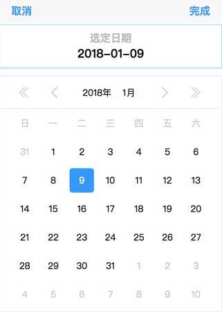
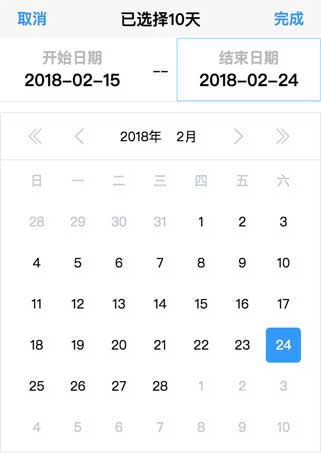

# mobile-input-date

> Date Input For Mobile

## Installation
```sh
npm install --save vue-mobile-input-date
```

## Build Setup

```sh
# install dependencies
npm install

# develop env , example.js
npm run dev
# generate example.js
npm run build

# generate MobileInputDate.js & MobileInputDate.min.js
npm run prod
```

## example images




# Usage

## Import

1. browser: 直接挂载到全局

```html
<script type="text/javascript" src="./lib/MobileInputDate.js"></script>
<!-- 或 -->
<script type="text/javascript" src="./lib/MobileInputDate.min.js"></script>
```

2. Vue全局式

```js
import MobileInputDate from 'vue-mobile-input-date';

Vue.use(MobileInputDate, {
    name: 'ComName'  // default 'MobileInputDate'
});
```

3. Vue组件式
```js
import MobileInputDate from 'vue-mobile-input-date';

export default {
    ...
    components: {
        MobileInputDate
    },
    ...
}
```

## Option
1. `limit.start`: date select start this day, value mode is 'yyyy-mm-dd'
2. `limit.end`: date select end this day, value mode is 'yyyy-mm-dd'
3. `isRange`:
    - `false`: is Date Select normal mode.
    result is object have props: `oneDate`
    - `true`: is Date Select range mode.
    result is object have props: `startDate`,`endDate`
3. `visible`: component mode, must `visible` to display component

## Demo

### 1. browser方式 / Vue全局式
- 页面式
```html
<MobileInputDate v-model="d" />
<button @click="d.visible = !d.visible">通过 组件 点击</button>

<script type="text/javascript">
new Vue({
    ...
    data: {
        d: {
            visible: false,
            isRange: false,
            startDate: '2013-6-23',
            endDate: '2013-6-23',
            oneDate: '2018-1-9',
            limit: {
                start: '2010-11-9',
                end: '2022-6-21'
            }
        }
    },
    watch: {
        'd.oneDate'(val) {
            console.log(val);
        }
    }
    ...
});
</script>
```
- 函数式
```js
// 只有通过Vue.use方式导入才有
// 通过局部组件方式导入,没有此方法
// 此方法名和Vue.use时设置的一样
Vue.prototype.$MobileInputDate && Vue.prototype.$MobileInputDate({
    isRange: true,
    startDate: '',
    endDate: '',
    oneDate: '',
    limit: {
        start: '2010-10-9',
        end: '2020-6-21'
    }
}).then((d) => {
    /*
    1. isRange: false
        {
            oneDate: '2017-09-16'
        }

    2. isRange: true

        {
            startDate: '2017-09-18',
            endDate: '2017-11-08'
        }
    */
    console.log(d);
});
```

### 2. Vue组件式

```html
<template>
    <div id="app">
        <MobileInputDate v-model="d"/>
        <button @click="d.visible = !d.visible">通过 组件 点击</button>
    </div>
</template>

<script>
import MobileInputDate from './index.js';

export default {
    name: 'App',
    components: {
        MobileInputDate
    },
    data() {
        return {
            d: {
                visible: false,
                isRange: true,
                startDate: '2013-6-23',
                endDate: '2013-6-23',
                oneDate: '2018-1-9',
                limit: {
                    start: '2010-11-9',
                    end: '2022-6-21'
                }
            }
        };
    },
    watch: {
        'd.startDate'() {
            console.log(this.d.startDate, this.d.endDate);
        }
    }
};
</script>
```
